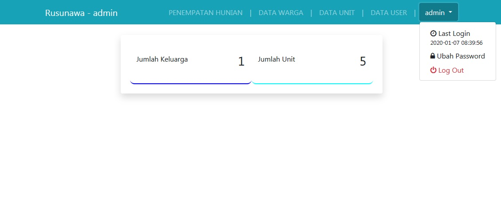
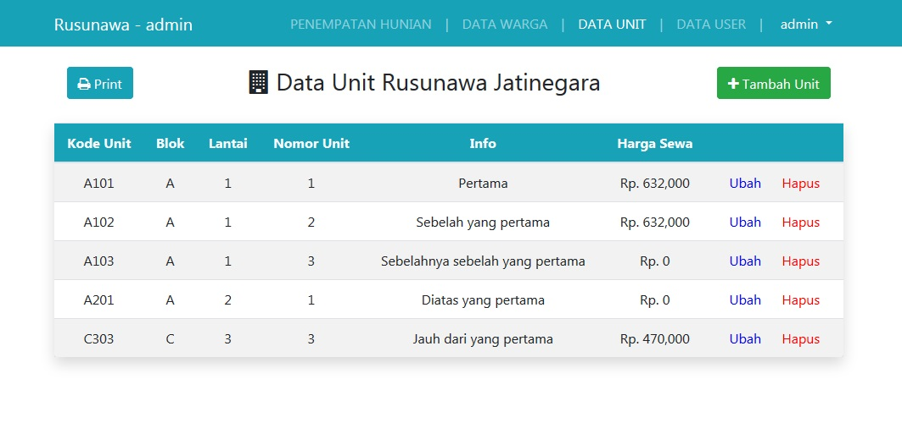
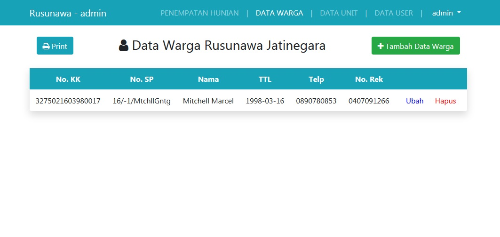
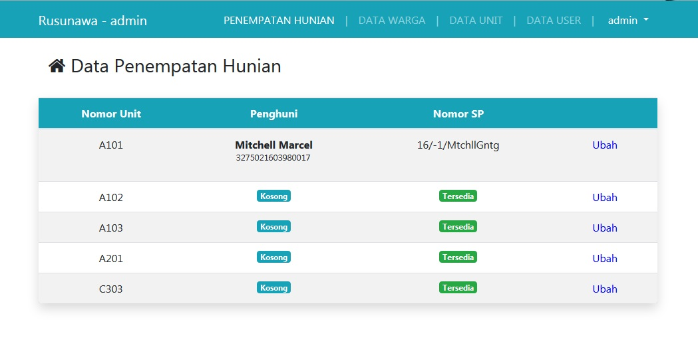
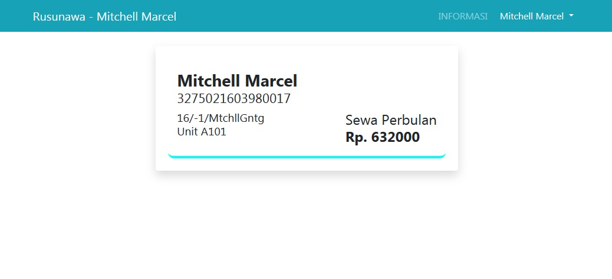
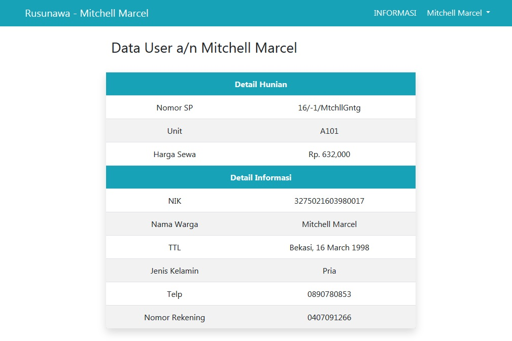

# Sistem-Informasi-Penempatan-Rusun
Rusunawa unit placement

Lang: Procedural PHP

SIM Rusunawa adalah sebuah aplikasi (program komputer, software, perangkat lunak) yang digunakan untuk menghimpun dan memroses data menjadi informasi yang berguna, sehingga memudahkan pengelolaan dan pengawasan, mempercepat pelayanan dan meningkatkan mutu pelayanan kepada pihak-pihak terkait (calon penghuni, penghuni, Pemda , masyarakat)

 

	Benefit: 
<ul>
	<li>Bagi calon penghuni Rusunawa: dapat mengetahui dengan segera status ketersediaan hunian yang dapat disewa, dan dapat mengetahui jadwal ketersediaan hunian kosong pada perioda berikutnya</li>
	<li>Bagi pengelola Rusunawa: memudahkan dalam pengelolaan, mempercepat memperoleh informasi yang dibutuhkan, menyediakan sistem pelaporan secara instan, mempercepat pengambilan keputusan</li>

</ul>

Page Preview:

<ul>
	<li>
		<h2>Admin</h2>
		
Hak akses dilakukan oleh admin. Dimana admin dapat mengelola Data Unit, Data Warga, Penempatan

		<ul>
			<li>
				<h4>Dashboard</h4>
				
Menyajikan banyaknya unit dan warga yang ada

				
			</li>
			<li>
				<h4>Data Unit</h4>
				
Menyajikan Data Unit yang sudah disimpan oleh admin. Informasi yang ditampilkan berupa Kode Unit, Blok, Lantai, Nomor, Detail Informasi, dan Harga Sewa

				
			</li>
			<li>
				<h4>Data Warga</h4>
				
Menyajikan Data Warga yang telah disimpan oleh admin. Informasi yang ditampilkan berupa Nomor KK, Nomor SP, Nama, TTL, Telp, Nomor Rekening

				
			</li>
			<li>
				<h4>Data Penempatan</h4>
				
Menyajikan Penempatan Warga yang telah ditetapkan oleh admin. Informasi yang ditampilkan berupa Nomor Unit, Nama Warga, dan Nomor SP

				
			</li>
		</ul>
	</li>
	<li>
		<h2>User</h2>
		
Hak akses dilakukan oleh user/warga.

		<ul>
			<li>
				<h4>Dashboard</h4>
				
Menyajikan Kartu Warga

				
			</li>
			<li>
				<h4>Informasi</h4>
				
Menyajikan Detail Informasi Pribadi

				
			</li>
		</ul>
	</li>
</ul>
